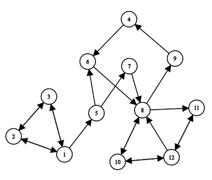
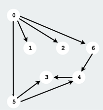
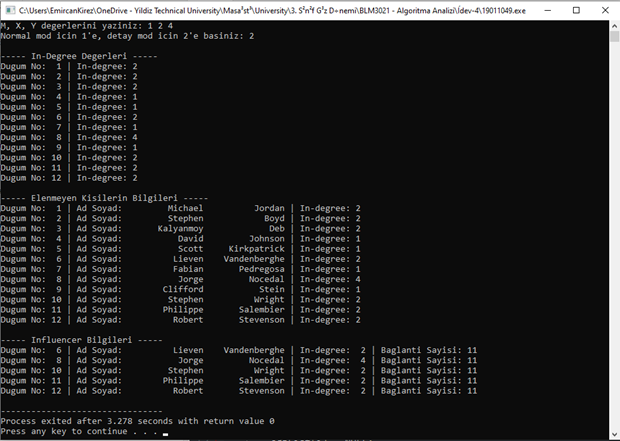

# Son Güncelleme: 20/12/2022
• Bu projede bir sosyal ağda influencer olan kişileri DFS yada BFS algoritmasını kullanarak tespit eden bir algoritma geliştirilmiştir.  

• Verilen "socialNET.txt" dosyasından bilgiler okunmuş ve adjacency list oluşturulmuştur.  

 
    

• Verilen yönlü grafta düğümler kişilerin ad ve soyad bilgilerini taşımaktadır.  

• Bir grafta hangi düğümlerin influencer kişilere ait olduğunu bulurken her düğüm için hesaplama yapmak gerekir fakat özellikle büyük bir ağda, az takipçisi olan kişiler için de işlem yapmak gereksiz zaman kaybı olacaktır.  

• Influcencer olma potansiyeli olmayan düğümleri elemek için eleminate(..) fonksiyonu kullanılmıştır. Burada in-degreesi (kendisine doğru olan bağlantılar), kullanıcıdan alınan M değerinden küçük olanlar elenmiştir. Eleme işlemi sonucu in-degree değeri M'nin altına düşen düğümler de elenmiştir ve bu işlem in-degree değeri M'in altında olan düğüm kalmayana kadar tekrarlanmıştır. 

• Elenmeyen düğümler için bir düğüme doğrudan ve dolaylı yoldan gelen toplam bağlantı sayısı hesaplanmıştır. Örn:  

&nbsp;&nbsp;&nbsp;&nbsp; 3 numaralı düğüme; 5, 4, 6 ve 0 numaralı düğümlerden ulaşabiliyoruz. Bu durumda bağlantı sayısı 3 numaralı düğüm için 4 olur.  

  

 
• Son aşamada ise yine kullanıcıdan alınan X ve Y değerleri ile influencer kişiler bulunmuştur. Elenmeyen düğümlerin influencer olabilmesi için in-degree değerleri X >= ? ve bağlantı sayıları Y >= ? koşullarını sağlaması gerekmektedir. (? = düğümün ilgili değeri) 

• Sistemde normal ve detay mod olmak üzere iki mod bulunmaktadır. Aralarındaki fark ekrana yazdırdıkları bilgi sayısıdır.  
- Normal Mod:
    * Influencer Bilgileri
- Detay Mod:
    * Başlangıçtaki In-degree Değerleri
    * Elenmeyen Kişilerin Bilgileri
    * Influencer Bilgileri

### Örnek 
• M = 1, X = 2, Y = 4
- Hiçbir node elenmeyip; 4, 5, 7 ve 9 X değerinden dolayı 1, 2 ve 3 ise Y değerinden dolayı influencer olamamıştır. Bu durumda 6, 8, 10, 11 ve 12 düğüm no'lu kişiler influencer olur.

  

